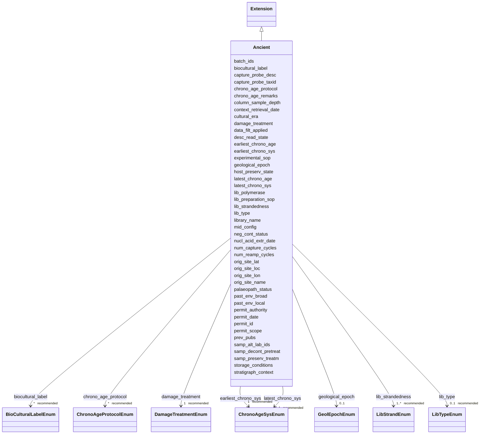

# Class: ancient (Ancient) 


_A collection of terms appropriate when collecting samples and sequencing samples  of data containing ancient nucleic acids, i.e., degraded molecules not from living organisms._


URI: [MIXS:9999903](https://w3id.org/mixs/9999903)





## Inheritance
* [Extension](Extension.md)
    * **Ancient**


## Class Properties

| Property | Value |
| --- | --- |
| Class URI | [MIXS:9999903](https://w3id.org/mixs/9999903) |


## Slots

| Name | Cardinality and Range | Description | Inheritance |
| ---  | --- | --- | --- |
| [orig_site_name](orig_site_name.md) | * _recommended_ <br/> [String](String.md) | Designated name of the archaeological or ecological site, ancient settlement,... | direct |
| [orig_site_loc](orig_site_loc.md) | 0..1 <br/> [String](String.md) | The original geographical origin of the sample, when sampled outside its orig... | direct |
| [orig_site_lat](orig_site_lat.md) | 0..1 <br/> [String](String.md) | The latitude coordinate of the original geographical origin of the sample, e | direct |
| [orig_site_lon](orig_site_lon.md) | 0..1 <br/> [String](String.md) | The longitude coordinate of the original geographical origin of the sample, e | direct |
| [past_env_broad](past_env_broad.md) | 0..1 _recommended_ <br/> [String](String.md) | Report information about the general ancient broad environmental system that ... | direct |
| [past_env_local](past_env_local.md) | 0..1 _recommended_ <br/> [String](String.md) | Report information about the smaller-scale environmental system of the local ... | direct |
| [stratigraph_context](stratigraph_context.md) | * <br/> [String](String.md) | Associated stratigraphic context(s) that the sample was retrieved from, usual... | direct |
| [column_sample_depth](column_sample_depth.md) | 0..1 <br/> [String](String.md) | Distance relative to the top or beginning of the sediment core or stratigraph... | direct |
| [context_retrieval_date](context_retrieval_date.md) | 0..1 _recommended_ <br/> [Datetime](Datetime.md) | Date of excavation or retrieval from burial or depositional context, if known | direct |
| [permit_id](permit_id.md) | * _recommended_ <br/> [String](String.md) | A permit ID, code, or any form of identify provided by any authority (ethical... | direct |
| [permit_authority](permit_authority.md) | * _recommended_ <br/> [String](String.md) | Name of the authorit(ies) or institution(s) that granted sampling and analysi... | direct |
| [permit_date](permit_date.md) | * _recommended_ <br/> [Datetime](Datetime.md) | Date on which a permit was granted | direct |
| [permit_scope](permit_scope.md) | * _recommended_ <br/> [String](String.md) | Description of the original scope and permissions of the research on the gene... | direct |
| [biocultural_label](biocultural_label.md) | * _recommended_ <br/> [BioCulturalLabelEnum](BioCulturalLabelEnum.md) | Relevant biocultural labels defined by the local contexts project (https://lo... | direct |
| [samp_alt_lab_ids](samp_alt_lab_ids.md) | * <br/> [String](String.md) | An alternative sample or material IDs related to the sample not already cover... | direct |
| [prev_pubs](prev_pubs.md) | * <br/> [String](String.md) | Any publications that report data from the same body/skeleton/individual | direct |
| [host_preserv_state](host_preserv_state.md) | 0..1 <br/> [String](String.md) | Description of the state of the sampled (ancient) organism/host as originally... | direct |
| [storage_conditions](storage_conditions.md) | 0..1 <br/> [String](String.md) | General surrounding environmental conditions where the material was stored in... | direct |
| [samp_preserv_treatm](samp_preserv_treatm.md) | * <br/> [String](String.md) | Description of any treatment applied directly to samples for the specific pur... | direct |
| [cultural_era](cultural_era.md) | 0..1 <br/> [String](String.md) | The cultural era approximating to the period in which the archaeological rema... | direct |
| [geological_epoch](geological_epoch.md) | 0..1 <br/> [GeolEpochEnum](GeolEpochEnum.md) | The geological epoch approximating to the period within which the specimen or... | direct |
| [earliest_chrono_age](earliest_chrono_age.md) | 1 _recommended_ <br/> [Integer](Integer.md) | The maximum/earliest/oldest possible age of a specimen as determined by a dat... | direct |
| [earliest_chrono_sys](earliest_chrono_sys.md) | 1 _recommended_ <br/> [ChronoAgeSysEnum](ChronoAgeSysEnum.md) | The reference system associated with the earliest_chrono_age | direct |
| [latest_chrono_age](latest_chrono_age.md) | 1 _recommended_ <br/> [Integer](Integer.md) | The minimum/latest/youngest possible age of a specimen as determined by a dat... | direct |
| [latest_chrono_sys](latest_chrono_sys.md) | 1 _recommended_ <br/> [ChronoAgeSysEnum](ChronoAgeSysEnum.md) | The reference system associated with the latest_chrono_age | direct |
| [chrono_age_protocol](chrono_age_protocol.md) | * _recommended_ <br/> [ChronoAgeProtocolEnum](ChronoAgeProtocolEnum.md) | A description of or reference to the methods used to determine the earliest_c... | direct |
| [chrono_age_remarks](chrono_age_remarks.md) | 0..1 _recommended_ <br/> [String](String.md) | Notes or comments about the  earliest_chrono_age and latest_chrono_age | direct |
| [palaeopath_status](palaeopath_status.md) | 0..1 <br/> [String](String.md) | Describe briefly any relevant palaeopathological or health-related observatio... | direct |
| [batch_ids](batch_ids.md) | * <br/> [String](String.md) | Identifiers for any form of batch or 'group' that the samples is associated w... | direct |
| [neg_cont_status](neg_cont_status.md) | 1 _recommended_ <br/> [Boolean](Boolean.md) | Specify whether the sample is a negative control or not | direct |
| [samp_decont_pretreat](samp_decont_pretreat.md) | * <br/> [String](String.md) | Protocols employed for sample surface decontamination of external  modern nuc... | direct |
| [damage_treatment](damage_treatment.md) | 1 _recommended_ <br/> [DamageTreatmentEnum](DamageTreatmentEnum.md) | Indication of whether characteristic ancient DNA damage has been altered or r... | direct |
| [nucl_acid_extr_date](nucl_acid_extr_date.md) | 0..1 <br/> [Datetime](Datetime.md) | The date when the nucleic acid extraction was started from the sample materia... | direct |
| [experimental_sop](experimental_sop.md) | * <br/> [String](String.md) | Provide a DOI or URL to refer to the paper where the field report, nucleic ac... | direct |
| [mid_config](mid_config.md) | * _recommended_ <br/> [String](String.md) | Index/barcode/primer configuration used during library building for sequencin... | direct |
| [library_name](library_name.md) | * _recommended_ <br/> [String](String.md) | Any ID or name used for referring to a nucleic acid sequencing library associ... | direct |
| [lib_polymerase](lib_polymerase.md) | 0..1 _recommended_ <br/> [String](String.md) | The polymerase enzyme used for building nucleic acid libraries | direct |
| [lib_strandedness](lib_strandedness.md) | 1..* _recommended_ <br/> [LibStrandEnum](LibStrandEnum.md) | The strandedness of the original template nucleic acid molecules used for con... | direct |
| [lib_type](lib_type.md) | 0..1 _recommended_ <br/> [LibTypeEnum](LibTypeEnum.md) | The type of library created, i | direct |
| [lib_preparation_sop](lib_preparation_sop.md) | * <br/> [String](String.md) | Citation(s) for the nucleic acid library preparation protocol | direct |
| [num_reamp_cycles](num_reamp_cycles.md) | 0..1 <br/> [Integer](Integer.md) | Number of amplification cycles after library indexing PCR | direct |
| [num_capture_cycles](num_capture_cycles.md) | * <br/> [Integer](Integer.md) | Number of amplification cycles after capture enrichment | direct |
| [capture_probe_taxid](capture_probe_taxid.md) | * <br/> [Integer](Integer.md) | NCBI taxon ID(s) of all organisms included in the baits of a whole organelle ... | direct |
| [capture_probe_desc](capture_probe_desc.md) | * <br/> [String](String.md) | Description of target enrichment probe designs used (e | direct |
| [desc_read_state](desc_read_state.md) | 0..1 _recommended_ <br/> [String](String.md) | Description of the state of the reads in the sequencing data file | direct |
| [data_filt_applied](data_filt_applied.md) | 0..1 _recommended_ <br/> [Boolean](Boolean.md) | Specify whether associated data was filtered prior to upload, such as host re... | direct |


## Usages

| used by | used in | type | used |
| ---  | --- | --- | --- |
| [MixsCompliantData](MixsCompliantData.md) | [ancient_data](ancient_data.md) | range | [Ancient](Ancient.md) |


## Comments

* This extension that is intended to be used in very specific cases but almost always in conjunction with other MIxS checklists and extensions. It does not therefore (currently) include additional common terms from checklists.


## Identifier and Mapping Information


### Annotations

| property | value |
| --- | --- |
| use_cases | ancient dna samples |


### Schema Source


* from schema: https://w3id.org/mixs


## Mappings

| Mapping Type | Mapped Value |
| ---  | ---  |
| self | MIXS:9999903 |
| native | MIXS:Ancient |


## LinkML Source

<!-- TODO: investigate https://stackoverflow.com/questions/37606292/how-to-create-tabbed-code-blocks-in-mkdocs-or-sphinx -->

### Direct

<details>
```yaml
name: Ancient
annotations:
  use_cases:
    tag: use_cases
    value: ancient dna samples
description: A collection of terms appropriate when collecting samples and sequencing
  samples  of data containing ancient nucleic acids, i.e., degraded molecules not
  from living organisms.
title: ancient
comments:
- This extension that is intended to be used in very specific cases but almost always
  in conjunction with other MIxS checklists and extensions. It does not therefore
  (currently) include additional common terms from checklists.
from_schema: https://w3id.org/mixs
is_a: Extension
slots:
- orig_site_name
- orig_site_loc
- orig_site_lat
- orig_site_lon
- past_env_broad
- past_env_local
- stratigraph_context
- column_sample_depth
- context_retrieval_date
- permit_id
- permit_authority
- permit_date
- permit_scope
- biocultural_label
- samp_alt_lab_ids
- prev_pubs
- host_preserv_state
- storage_conditions
- samp_preserv_treatm
- cultural_era
- geological_epoch
- earliest_chrono_age
- earliest_chrono_sys
- latest_chrono_age
- latest_chrono_sys
- chrono_age_protocol
- chrono_age_remarks
- palaeopath_status
- batch_ids
- neg_cont_status
- samp_decont_pretreat
- damage_treatment
- nucl_acid_extr_date
- experimental_sop
- mid_config
- library_name
- lib_polymerase
- lib_strandedness
- lib_type
- lib_preparation_sop
- num_reamp_cycles
- num_capture_cycles
- capture_probe_taxid
- capture_probe_desc
- desc_read_state
- data_filt_applied
slot_usage:
  orig_site_name:
    name: orig_site_name
    rank: 1
    slot_group: Environment
  orig_site_loc:
    name: orig_site_loc
    rank: 2
    slot_group: Environment
  orig_site_lat:
    name: orig_site_lat
    rank: 3
    slot_group: Environment
  orig_site_lon:
    name: orig_site_lon
    rank: 4
    slot_group: Environment
  past_env_broad:
    name: past_env_broad
    rank: 5
    slot_group: Environment
  past_env_local:
    name: past_env_local
    rank: 6
    slot_group: Environment
  context_retrieval_date:
    name: context_retrieval_date
    rank: 7
    slot_group: Environment
  stratigraph_context:
    name: stratigraph_context
    rank: 8
    slot_group: Environment
  column_sample_depth:
    name: column_sample_depth
    rank: 9
    slot_group: Environment
  permit_id:
    name: permit_id
    rank: 10
    slot_group: Sample body
  permit_authority:
    name: permit_authority
    rank: 11
    slot_group: Sample body
  permit_date:
    name: permit_date
    rank: 12
    slot_group: Sample body
  permit_scope:
    name: permit_scope
    rank: 13
    slot_group: Sample body
  biocultural_label:
    name: biocultural_label
    rank: 14
    slot_group: Sample body
  samp_alt_lab_ids:
    name: samp_alt_lab_ids
    rank: 15
    slot_group: Sample body
  prev_pubs:
    name: prev_pubs
    rank: 16
    slot_group: Sample body
  host_preserv_state:
    name: host_preserv_state
    rank: 17
    slot_group: Sample body
  storage_conditions:
    name: storage_conditions
    rank: 18
    slot_group: Sample body
  samp_preserv_treatm:
    name: samp_preserv_treatm
    rank: 19
    slot_group: Sample body
  cultural_era:
    name: cultural_era
    rank: 20
    slot_group: Sample body
  geological_epoch:
    name: geological_epoch
    rank: 21
    slot_group: Sample body
  earliest_chrono_age:
    name: earliest_chrono_age
    rank: 22
    slot_group: Sample body
  earliest_chrono_sys:
    name: earliest_chrono_sys
    rank: 23
    slot_group: Sample body
  latest_chrono_age:
    name: latest_chrono_age
    rank: 24
    slot_group: Sample body
  latest_chrono_sys:
    name: latest_chrono_sys
    rank: 25
    slot_group: Sample body
  chrono_age_protocol:
    name: chrono_age_protocol
    rank: 26
    slot_group: Sample body
  chrono_age_remarks:
    name: chrono_age_remarks
    rank: 27
    slot_group: Sample body
  palaeopath_status:
    name: palaeopath_status
    rank: 28
    slot_group: Sample body
  batch_ids:
    name: batch_ids
    rank: 29
    slot_group: Nucleic acid source
  neg_cont_status:
    name: neg_cont_status
    rank: 30
    slot_group: Nucleic acid source
  samp_decont_pretreat:
    name: samp_decont_pretreat
    rank: 31
    slot_group: Nucleic acid source
  damage_treatment:
    name: damage_treatment
    rank: 32
    slot_group: Nucleic acid source
  nucl_acid_extr_date:
    name: nucl_acid_extr_date
    rank: 33
    slot_group: Nucleic acid source
  experimental_sop:
    name: experimental_sop
    rank: 34
    slot_group: Nucleic acid source
  mid_config:
    name: mid_config
    rank: 35
    slot_group: Sequencing
  library_name:
    name: library_name
    rank: 36
    slot_group: Sequencing
  lib_polymerase:
    name: lib_polymerase
    rank: 37
    slot_group: Sequencing
  lib_strandedness:
    name: lib_strandedness
    rank: 38
    slot_group: Sequencing
  lib_preparation_sop:
    name: lib_preparation_sop
    rank: 39
    slot_group: Sequencing
  lib_type:
    name: lib_type
    rank: 40
    slot_group: Sequencing
  num_reamp_cycles:
    name: num_reamp_cycles
    rank: 41
    slot_group: Sequencing
  num_capture_cycles:
    name: num_capture_cycles
    rank: 42
    slot_group: Sequencing
  capture_probe_taxid:
    name: capture_probe_taxid
    rank: 43
    slot_group: Sequencing
  capture_probe_desc:
    name: capture_probe_desc
    rank: 44
    slot_group: Sequencing
  desc_read_state:
    name: desc_read_state
    rank: 45
    slot_group: Data analysis
  data_filt_applied:
    name: data_filt_applied
    rank: 46
    slot_group: Data analysis
class_uri: MIXS:9999903

```
</details>

### Induced

<details>
```yaml
name: Ancient
annotations:
  use_cases:
    tag: use_cases
    value: ancient dna samples
description: A collection of terms appropriate when collecting samples and sequencing
  samples  of data containing ancient nucleic acids, i.e., degraded molecules not
  from living organisms.
title: ancient
comments:
- This extension that is intended to be used in very specific cases but almost always
  in conjunction with other MIxS checklists and extensions. It does not therefore
  (currently) include additional common terms from checklists.
from_schema: https://w3id.org/mixs
is_a: Extension
slot_usage:
  orig_site_name:
    name: orig_site_name
    rank: 1
    slot_group: Environment
  orig_site_loc:
    name: orig_site_loc
    rank: 2
    slot_group: Environment
  orig_site_lat:
    name: orig_site_lat
    rank: 3
    slot_group: Environment
  orig_site_lon:
    name: orig_site_lon
    rank: 4
    slot_group: Environment
  past_env_broad:
    name: past_env_broad
    rank: 5
    slot_group: Environment
  past_env_local:
    name: past_env_local
    rank: 6
    slot_group: Environment
  context_retrieval_date:
    name: context_retrieval_date
    rank: 7
    slot_group: Environment
  stratigraph_context:
    name: stratigraph_context
    rank: 8
    slot_group: Environment
  column_sample_depth:
    name: column_sample_depth
    rank: 9
    slot_group: Environment
  permit_id:
    name: permit_id
    rank: 10
    slot_group: Sample body
  permit_authority:
    name: permit_authority
    rank: 11
    slot_group: Sample body
  permit_date:
    name: permit_date
    rank: 12
    slot_group: Sample body
  permit_scope:
    name: permit_scope
    rank: 13
    slot_group: Sample body
  biocultural_label:
    name: biocultural_label
    rank: 14
    slot_group: Sample body
  samp_alt_lab_ids:
    name: samp_alt_lab_ids
    rank: 15
    slot_group: Sample body
  prev_pubs:
    name: prev_pubs
    rank: 16
    slot_group: Sample body
  host_preserv_state:
    name: host_preserv_state
    rank: 17
    slot_group: Sample body
  storage_conditions:
    name: storage_conditions
    rank: 18
    slot_group: Sample body
  samp_preserv_treatm:
    name: samp_preserv_treatm
    rank: 19
    slot_group: Sample body
  cultural_era:
    name: cultural_era
    rank: 20
    slot_group: Sample body
  geological_epoch:
    name: geological_epoch
    rank: 21
    slot_group: Sample body
  earliest_chrono_age:
    name: earliest_chrono_age
    rank: 22
    slot_group: Sample body
  earliest_chrono_sys:
    name: earliest_chrono_sys
    rank: 23
    slot_group: Sample body
  latest_chrono_age:
    name: latest_chrono_age
    rank: 24
    slot_group: Sample body
  latest_chrono_sys:
    name: latest_chrono_sys
    rank: 25
    slot_group: Sample body
  chrono_age_protocol:
    name: chrono_age_protocol
    rank: 26
    slot_group: Sample body
  chrono_age_remarks:
    name: chrono_age_remarks
    rank: 27
    slot_group: Sample body
  palaeopath_status:
    name: palaeopath_status
    rank: 28
    slot_group: Sample body
  batch_ids:
    name: batch_ids
    rank: 29
    slot_group: Nucleic acid source
  neg_cont_status:
    name: neg_cont_status
    rank: 30
    slot_group: Nucleic acid source
  samp_decont_pretreat:
    name: samp_decont_pretreat
    rank: 31
    slot_group: Nucleic acid source
  damage_treatment:
    name: damage_treatment
    rank: 32
    slot_group: Nucleic acid source
  nucl_acid_extr_date:
    name: nucl_acid_extr_date
    rank: 33
    slot_group: Nucleic acid source
  experimental_sop:
    name: experimental_sop
    rank: 34
    slot_group: Nucleic acid source
  mid_config:
    name: mid_config
    rank: 35
    slot_group: Sequencing
  library_name:
    name: library_name
    rank: 36
    slot_group: Sequencing
  lib_polymerase:
    name: lib_polymerase
    rank: 37
    slot_group: Sequencing
  lib_strandedness:
    name: lib_strandedness
    rank: 38
    slot_group: Sequencing
  lib_preparation_sop:
    name: lib_preparation_sop
    rank: 39
    slot_group: Sequencing
  lib_type:
    name: lib_type
    rank: 40
    slot_group: Sequencing
  num_reamp_cycles:
    name: num_reamp_cycles
    rank: 41
    slot_group: Sequencing
  num_capture_cycles:
    name: num_capture_cycles
    rank: 42
    slot_group: Sequencing
  capture_probe_taxid:
    name: capture_probe_taxid
    rank: 43
    slot_group: Sequencing
  capture_probe_desc:
    name: capture_probe_desc
    rank: 44
    slot_group: Sequencing
  desc_read_state:
    name: desc_read_state
    rank: 45
    slot_group: Data analysis
  data_filt_applied:
    name: data_filt_applied
    rank: 46
    slot_group: Data analysis
attributes:
  orig_site_name:
    name: orig_site_name
    annotations:
      Expected_value:
        tag: Expected_value
        value: Name of site or location where sample was originated
    description: Designated name of the archaeological or ecological site, ancient
      settlement, or location etc. where the sample was originally collected. Can
      be a non-geographical name, such as a field-specific name or code, the official
      name of an excavation, or a colloquial name that is used in academic literature.
      Typically names that would not be found on official maps. If the site name is
      unclear please use the name of the closest location or region as best as possible.
      Can also include different transliterations or languages used in the literature.
    title: Name of site or location where sample originated
    examples:
    - value: Valley of the Kings
    - value: Krakow Spadzista B
    - value: Coopers Cave
    - value: Cutler Fossil Site
    - value: Kap København Formation
    - value: Northern Italy, Lombardy, exact location unknown
    in_subset:
    - environment
    from_schema: https://w3id.org/mixs
    rank: 1
    keywords:
    - environment
    - sample
    slot_uri: MIXS:999999901
    alias: orig_site_name
    owner: Ancient
    domain_of:
    - Ancient
    slot_group: Environment
    range: string
    required: false
    recommended: true
    multivalued: true
  orig_site_loc:
    name: orig_site_loc
    annotations:
      Expected_value:
        tag: Expected_value
        value: Name of original geographic origin of the sample
    description: The original geographical origin of the sample, when sampled outside
      its original natural environment (e.g. sampled in a museum collection), as defined
      by the country or sea name followed by specific region name.  Country or sea
      names should be chosen from the INSDC country list (http://insdc.org/country.html),
      or the GAZ ontology (http://purl.bioontology.org/ontology/GAZ).
    title: original site location
    examples:
    - value: 'South Africa: Western Cape'
    - value: 'Germany: Baden-Württemberg, Geißenklösterle Cave'
    - value: 'Northern Italy: Lombardy'
    in_subset:
    - environment
    from_schema: https://w3id.org/mixs
    rank: 2
    keywords:
    - location
    - site
    slot_uri: MIXS:999999902
    alias: orig_site_loc
    owner: Ancient
    domain_of:
    - Ancient
    slot_group: Environment
    range: string
    required: false
    recommended: false
    multivalued: false
    structured_pattern:
      syntax: '^{country}: {region}, {specific_location}$'
  orig_site_lat:
    name: orig_site_lat
    description: The latitude coordinate of the original geographical origin of the
      sample, e.g. the original place the sample was buried, deposited, or formed.
      In cases where the sample was directly sampled in the burial environment for
      the purposes of scientific investigation, this will be the same as geo_loc_name,
      and lat_lon.  For samples kept in collections, the geo_loc_name and lat_lon
      terms are used to refer to the collection where the sample is stored, but this
      term is used for the original geographic location the sample existed in prior
      to archiving in a collection (i.e., should correspond to  orig_site_loc, not
      the collection itself as recorded in site_name). The values should be reported
      in decimal degrees, limited to 8 decimal points, and in WGS84 system.
    title: original geographic location (latitude)
    examples:
    - value: '50.586825'
    - value: '-0.123'
    in_subset:
    - environment
    from_schema: https://w3id.org/mixs
    rank: 3
    slot_uri: MIXS:999999903
    alias: orig_site_lat
    owner: Ancient
    domain_of:
    - Ancient
    slot_group: Environment
    range: string
    required: false
    recommended: false
    multivalued: false
    structured_pattern:
      syntax: ^{lat}$
      interpolated: true
      partial_match: true
  orig_site_lon:
    name: orig_site_lon
    description: The longitude coordinate of the original geographical origin of the
      sample, e.g. the original place the sample was buried, deposited, or formed.
      In cases where the sample was directly sampled in the burial environment for
      the purposes of scientific investigation, this will be the same as geo_loc_name,
      and lat_lon.  For samples kept in collections, the geo_loc_name and lat_lon
      terms are used to refer to the collection where the sample is stored, but this
      term is used for the original geographic location the sample existed in prior
      to archiving in a collection (i.e., should correspond to orig_site_loc, not
      the collection itself, as recorded in site_name). The values should be reported
      in decimal degrees, limited to 8 decimal points, and in WGS84 system.
    title: original geographic location (longitude)
    examples:
    - value: '6.408977'
    - value: '-12.12'
    in_subset:
    - environment
    from_schema: https://w3id.org/mixs
    rank: 4
    slot_uri: MIXS:999999904
    alias: orig_site_lon
    owner: Ancient
    domain_of:
    - Ancient
    slot_group: Environment
    range: string
    required: false
    recommended: false
    multivalued: false
    structured_pattern:
      syntax: ^{lon}$
      interpolated: true
      partial_match: true
  past_env_broad:
    name: past_env_broad
    description: 'Report information about the general ancient broad environmental
      system that the sample or specimen existed or lived within, as it was at the
      time of deposition or burial (e.g. in the desert or a forest). This should not
      describe the environment as it is today (e.g. farmland), but specifically the
      state as it was in the past (i.e. the palaeo- or (pre)historical ecosystem).
      Compared to `env_broad_scale` which is taken from direct observation, the information
      about the past environment will normally be derived from inference from archaeological,
      palaeontological, geological, or other scientific methods. We recommend using
      subclasses of EnvO s biome class:  http://purl.obolibrary.org/obo/ENVO_00000428.
      EnvO documentation about how to use the field for present day equivalents: https://github.com/EnvironmentOntology/envo/wiki/Using-ENVO-with-MIxS"'
    title: broad-scale past environmental context
    examples:
    - value: dessert biome [ENVO:01000247]
    in_subset:
    - environment
    from_schema: https://w3id.org/mixs
    rank: 5
    keywords:
    - context
    - environmental
    - ancient
    slot_uri: MIXS:999999905
    alias: past_env_broad
    owner: Ancient
    domain_of:
    - Ancient
    slot_group: Environment
    range: string
    required: false
    recommended: true
    pattern: ^([^\s-]{1,2}|[^\s-]+.+[^\s-]+) \[[a-zA-Z]{2,}:[a-zA-Z0-9]\d+\]$
    structured_pattern:
      syntax: ^{termLabel} \[{termID}\]$
      interpolated: true
      partial_match: true
  past_env_local:
    name: past_env_local
    annotations:
      Expected_value:
        tag: Expected_value
        value: Report information about smaller environmental entities having causal
          influences upon the sample or specimen at/during the time of burial
    description: 'Report information about the smaller-scale environmental system
      of the local vicinity of the sample or specimen at the time of deposition or
      burial (e.g. in hillside, burial mound, or midden). This should not describe
      the environment as it is today (e.g. carpark), but specifically the entity or
      entities surrounding the sample that may have significant causal influences
      as it was in the past. Compared to `env_local_scale` which is taken from direct
      observation, the information about the past environment will normally be derived
      from inference from archaeological, palaeontological, geological, or other scientific
      methods. We recommend using EnvO terms which are of smaller than your entry
      for past_env_broad. Terms, such as anatomical sites, from other OBO Library
      ontologies which interoperate with EnvO (e.g. UBERON) are accepted in this field.
      EnvO documentation about how to use the field for present day equivalents: https://github.com/EnvironmentOntology/envo/wiki/Using-ENVO-with-MIxS"'
    title: local past environmental context
    examples:
    - value: hillside [ENVO:01000333]
    in_subset:
    - environment
    from_schema: https://w3id.org/mixs
    rank: 6
    keywords:
    - context
    - environmental
    - ancient
    string_serialization: '{termLabel} [{termID}]'
    slot_uri: MIXS:999999906
    alias: past_env_local
    owner: Ancient
    domain_of:
    - Ancient
    slot_group: Environment
    range: string
    required: false
    recommended: true
  stratigraph_context:
    name: stratigraph_context
    annotations:
      Expected_value:
        tag: Expected_value
        value: Stratigraphic context that the sample was retrieved from
    description: Associated stratigraphic context(s) that the sample was retrieved
      from, usually from an archaeological or palaeontological excavation. Description(s)
      or identifier(s) of stratigraphic units or layer names within and/or relative
      to the site (e.g., stratigraphic unit ID, archaeological feature ID, layer name
      or a description, grid location).
    title: stratigraphic context
    examples:
    - value: Layer 5
    - value: Layer UE
    - value: Horizon IIc, Quadrant 77
    - value: HF_23447_77_410_IIc
    - value: KrSp C2/2011/B5
    - value: US10
    - value: YSL
    - value: Subunit 1
    - value: Black Mousterian (BM)
    in_subset:
    - environment
    from_schema: https://w3id.org/mixs
    rank: 8
    keywords:
    - identifiers
    - excavation
    slot_uri: MIXS:999999907
    alias: stratigraph_context
    owner: Ancient
    domain_of:
    - Ancient
    slot_group: Environment
    range: string
    required: false
    recommended: false
    multivalued: true
  column_sample_depth:
    name: column_sample_depth
    annotations:
      Expected_value:
        tag: Expected_value
        value: depth of the sample in the column of a stratigraphy or sediment core
    description: 'Distance relative to the top or beginning of the sediment core or
      stratigraphic sequence (defined by the term ''depth'') from which the sample
      was taken. This is not necessarily the same as the depth from floor level or
      Mean Sea Level (MSL) (which should be defined using the term: depth), as a core
      could start part way below the surface. Can also be a range if the depth of
      the sample is not precisely measured.'
    title: sample depth in column
    examples:
    - value: 34 cm
    - value: 23 - 56 cm
    - value: 100 in
    in_subset:
    - environment
    from_schema: https://w3id.org/mixs
    rank: 9
    keywords:
    - environment
    - core
    - sediment
    slot_uri: MIXS:999999908
    alias: column_sample_depth
    owner: Ancient
    domain_of:
    - Ancient
    slot_group: Environment
    range: string
    required: false
    recommended: false
    multivalued: false
    structured_pattern:
      syntax: ^{scientific_float}( *- *{scientific_float})? *{text}$
      interpolated: true
      partial_match: true
  context_retrieval_date:
    name: context_retrieval_date
    annotations:
      Preferred_unit:
        tag: Preferred_unit
        value: year
    description: 'Date of excavation or retrieval from burial or depositional context,
      if known. If excavations were done during a  longer period, report its midpoint
      at a month or year level. In case no exact time is available, the date can be  right
      truncated i.e. all of these are valid times: 2008-01-23T19:23:10+00:00; 2008-01-23T19:23:10;
      2008-01-23;  2008-01; 2008; Except: 2008-01; 2008 all are ISO8601 compliant.'
    title: date of retrieval from depositional context
    examples:
    - value: '2023'
    - value: 1972-11
    - value: '2001-09-25'
    in_subset:
    - nucleic acid sequence source
    from_schema: https://w3id.org/mixs
    rank: 7
    slot_uri: MIXS:999999909
    alias: context_retrieval_date
    owner: Ancient
    domain_of:
    - Ancient
    slot_group: Environment
    range: datetime
    required: false
    recommended: true
  permit_id:
    name: permit_id
    description: A permit ID, code, or any form of identify provided by any authority
      (ethical, local, legal, academic etc.) associated with the approval of the analysis
      of this particular sample, if available.
    title: permit or approval ID
    examples:
    - value: DE-123-JK
    in_subset:
    - investigation
    from_schema: https://w3id.org/mixs
    rank: 10
    keywords:
    - ethics
    slot_uri: MIXS:999999910
    alias: permit_id
    owner: Ancient
    domain_of:
    - Ancient
    slot_group: Sample body
    range: string
    required: false
    recommended: true
    multivalued: true
  permit_authority:
    name: permit_authority
    annotations:
      Expected_value:
        tag: Expected_value
        value: Name of authority providing permission or ethical approval.
    description: Name of the authorit(ies) or institution(s) that granted sampling
      and analysis (e.g. human remains) and/or export permission (e.g. animal remains),
      as well any form of ethical approval (whether from institutional research ethics
      boards such as REB or IRBs, or indigenous or native community associations),
      if available.
    title: permit authority
    examples:
    - value: University of Copenhagen
    - value: Federal Foreign Office (Germany)
    in_subset:
    - investigation
    from_schema: https://w3id.org/mixs
    rank: 11
    keywords:
    - ethics
    - location
    slot_uri: MIXS:999999911
    alias: permit_authority
    owner: Ancient
    domain_of:
    - Ancient
    slot_group: Sample body
    range: string
    required: false
    recommended: true
    multivalued: true
  permit_date:
    name: permit_date
    description: 'Date on which a permit was granted. The date can be right truncated
      i.e. all of these are valid times: 2008-01-23; 2008-01; 2008; Except: 2008-01;
      2008 all are ISO8601 compliant.'
    title: date of permit approval
    examples:
    - value: '2023-12-01'
    in_subset:
    - investigation
    from_schema: https://w3id.org/mixs
    rank: 12
    slot_uri: MIXS:999999912
    alias: permit_date
    owner: Ancient
    domain_of:
    - Ancient
    slot_group: Sample body
    range: datetime
    required: false
    recommended: true
    multivalued: true
  permit_scope:
    name: permit_scope
    annotations:
      Expected_value:
        tag: Expected_value
        value: Description of the scope of ethical permissions for data use.
    description: Description of the original scope and permissions of the research
      on the genetic material, as was approved by a legal, ethical, or relevant authority
      (e.g. bacteria only, DNA only, bacteria and human, no host read analysis allowed).
      Note this description is only informative, and will not necessarily automatically
      apply restrictions to associated data to other researchers.
    title: permit scope
    examples:
    - value: Defined scope only includes the study of bacterial sequences and any
        human sequence is not covered under the agreement.
    in_subset:
    - ethics
    from_schema: https://w3id.org/mixs
    rank: 13
    keywords:
    - ethics
    string_serialization: '{text}'
    slot_uri: MIXS:999999913
    alias: permit_scope
    owner: Ancient
    domain_of:
    - Ancient
    slot_group: Sample body
    range: string
    required: false
    recommended: true
    multivalued: true
  biocultural_label:
    name: biocultural_label
    annotations:
      Expected_value:
        tag: Expected_value
        value: Relevant biocultural label from https://localcontexts.org/labels/biocultural-labels/
    description: Relevant biocultural labels defined by the local contexts project
      (https://localcontexts.org/label/bc-provenance/) that describe in what ways
      this data can be reused, as permitted by any associated native or indigenous
      peoples or communities.
    title: biocultural label
    examples:
    - value: BC R
    - value: BC MC
    - value: BC MC;BC CV
    in_subset:
    - ethics
    from_schema: https://w3id.org/mixs
    rank: 14
    keywords:
    - ethics
    slot_uri: MIXS:999999914
    alias: biocultural_label
    owner: Ancient
    domain_of:
    - Ancient
    slot_group: Sample body
    range: BioCulturalLabelEnum
    required: false
    recommended: true
    multivalued: true
  samp_alt_lab_ids:
    name: samp_alt_lab_ids
    description: An alternative sample or material IDs related to the sample not already
      covered by terms samp_name and source_mat_id, including from associated other
      non-genetic analyses of the same sample (e.g. museum IDs, internal lab sample
      ID from sampling such a bone drilling). Can be specified multiple times for
      different ID contexts.
    title: alternative sample IDs
    examples:
    - value: ABC_24
    - value: Grave 6
    - value: 'Museum ID: NHM_AR_123, Drilling ID: DRL_001, Extraction ID: ABC_24'
    in_subset:
    - investigation
    from_schema: https://w3id.org/mixs
    rank: 15
    string_serialization: '{text}'
    slot_uri: MIXS:999999915
    alias: samp_alt_lab_ids
    owner: Ancient
    domain_of:
    - Ancient
    slot_group: Sample body
    range: string
    required: false
    recommended: false
    multivalued: true
  prev_pubs:
    name: prev_pubs
    description: Any publications that report data from the same body/skeleton/individual
    title: previous publications
    examples:
    - value: doi:10.1016/j.jas.2015.02.0181
    in_subset:
    - nucleic acid sequence source
    from_schema: https://w3id.org/mixs
    rank: 16
    slot_uri: MIXS:999999916
    alias: prev_pubs
    owner: Ancient
    domain_of:
    - Ancient
    slot_group: Sample body
    range: string
    required: false
    recommended: false
    multivalued: true
    pattern: ^^PMID:\d+$|^doi:10.\d{2,9}/.*$|^https?:\/\/(?:www\.)?[-a-zA-Z0-9@:%._\+~#=]{1,256}\.[a-zA-Z0-9()]{1,6}\b(?:[-a-zA-Z0-9()@:%_\+.~#?&\/=]*)$$
    structured_pattern:
      syntax: ^{PMID}|{DOI}|{URL}$
      interpolated: true
      partial_match: true
  host_preserv_state:
    name: host_preserv_state
    annotations:
      Expected_value:
        tag: Expected_value
        value: Description of the preservation of the sampled (ancient) organism/host
          at time/immediately after death.
    description: Description of the state of the sampled (ancient) organism/host as
      originally  preserved in the burial environment at the time of or immediately
      following death. This can be both natural or artificial, such as mummification
      or burning for funerary purposes.
    title: preservation state of sampled organism/host at/immediately after death
    examples:
    - value: complete artificial mummification.
    - value: natural partial mummification.
    - value: fully skeletonised.
    in_subset:
    - nucleic acid sequence source
    from_schema: https://w3id.org/mixs
    rank: 17
    keywords:
    - ancient
    string_serialization: '{text}'
    slot_uri: MIXS:999999917
    alias: host_preserv_state
    owner: Ancient
    domain_of:
    - Ancient
    slot_group: Sample body
    range: string
    required: false
    recommended: false
    multivalued: false
  storage_conditions:
    name: storage_conditions
    description: General surrounding environmental conditions where the material was
      stored in long-term collection storage prior sampling for nucleic acid analysis  that
      may influence nucleic acid recovery or library construction. For example, specify
      temperature, humidity, presence of microbial overgrowth etc..
    title: storage conditions
    examples:
    - value: climate-controlled
    - value: Mould growth in storage box observed
    - value: Stored at -20oC until 2025-05-15
    - value: Stored in the museum from 1924 to 2021
    in_subset:
    - nucleic acid sequence source
    from_schema: https://w3id.org/mixs
    rank: 18
    string_serialization: '{text}'
    slot_uri: MIXS:999999918
    alias: storage_conditions
    owner: Ancient
    domain_of:
    - Ancient
    slot_group: Sample body
    range: string
    required: false
    recommended: false
  samp_preserv_treatm:
    name: samp_preserv_treatm
    description: Description of any treatment applied directly to samples for the
      specific purpose of  maximising longevity of sample preservation in archives
      and/or collections by curators  that may influence downstream nucleic acid recovery
      or library construction, such as storage fluid or  reconstructive glue.
    title: preservational treatment
    examples:
    - value: stored in formalin
    - value: reconstructive glue applied
    - value: alcohol preserved
    in_subset:
    - nucleic acid sequence source
    from_schema: https://w3id.org/mixs
    rank: 19
    keywords:
    - ancient
    string_serialization: '{text}'
    slot_uri: MIXS:999999919
    alias: samp_preserv_treatm
    owner: Ancient
    domain_of:
    - Ancient
    slot_group: Sample body
    range: string
    required: false
    recommended: false
    multivalued: true
  cultural_era:
    name: cultural_era
    annotations:
      Expected_value:
        tag: Expected_value
        value: chronotology or PeriodO term; text
    description: The cultural era approximating to the period in which the archaeological
      remains existed in. Where possible use terms from ontologies such as Chronontology
      (https://chronontology.dainst.org/) or PeriodO (https://perio.do/en/).
    title: cultural era or period
    examples:
    - value: 'Copper Age [Chronotology: NW6hofAScJSE]'
    - value: Upper Middle Palaeolthic
    - value: Not collected
    in_subset:
    - nucleic acid sequence source
    from_schema: https://w3id.org/mixs
    rank: 20
    keywords:
    - ancient
    - age
    string_serialization: '{termLabel} [{termID}]|{text}'
    slot_uri: MIXS:999999920
    alias: cultural_era
    owner: Ancient
    domain_of:
    - Ancient
    slot_group: Sample body
    range: string
    required: false
    recommended: false
    multivalued: false
  geological_epoch:
    name: geological_epoch
    annotations:
      Expected_value:
        tag: Expected_value
        value: ontology term; text
    description: 'The geological epoch approximating to the period within which the
      specimen or sample existed. Where possible use terms from ontologies. NOTE:
      This term is for geological timescales. For more precise or anthropogenic defined
      periods, use `Cultural Era`.'
    title: geological epoch
    examples:
    - value: Pleistocene
    - value: Upper Cretaceous
    - value: Pliocene
    in_subset:
    - nucleic acid sequence source
    from_schema: https://w3id.org/mixs
    rank: 21
    keywords:
    - ancient
    - age
    slot_uri: MIXS:999999921
    alias: geological_epoch
    owner: Ancient
    domain_of:
    - Ancient
    slot_group: Sample body
    range: GeolEpochEnum
    required: false
    recommended: false
    multivalued: false
  earliest_chrono_age:
    name: earliest_chrono_age
    annotations:
      Expected_value:
        tag: Expected_value
        value: age value corresponding to unit
    description: The maximum/earliest/oldest possible age of a specimen as determined
      by a dating method. If multiple dating measurements available, use the most
      earliest/oldest date to provide widest range of age possibilities. The specific
      age unit should be specified by the term earliest_chrono_sys. More information
      on specific dates (e.g. radiocarbon lab codes) can be specified in the term
      chrono_age_remarks.
    title: Earliest Chronometric Age
    examples:
    - value: '120000'
    - value: '1900'
    in_subset:
    - nucleic acid sequence source
    from_schema: https://w3id.org/mixs
    broad_mappings:
    - chrono:earliestChronometricAge
    rank: 22
    slot_uri: MIXS:999999922
    alias: earliest_chrono_age
    owner: Ancient
    domain_of:
    - Ancient
    slot_group: Sample body
    range: integer
    required: true
    recommended: true
    multivalued: false
  earliest_chrono_sys:
    name: earliest_chrono_sys
    description: The reference system associated with the earliest_chrono_age.
    title: Earliest Chronometric Age Reference System
    examples:
    - value: cal BP
    - value: CE
    - value: Ma
    - value: ka
    in_subset:
    - investigation
    from_schema: https://w3id.org/mixs
    broad_mappings:
    - chrono:earliestChronometricAgeReferenceSystem
    rank: 23
    slot_uri: MIXS:999999923
    alias: earliest_chrono_sys
    owner: Ancient
    domain_of:
    - Ancient
    slot_group: Sample body
    range: ChronoAgeSysEnum
    required: true
    recommended: true
    multivalued: false
  latest_chrono_age:
    name: latest_chrono_age
    annotations:
      Expected_value:
        tag: Expected_value
        value: age value corresponding to unit
    description: The minimum/latest/youngest possible age of a specimen as determined
      by a dating method. If multiple dating measurements available, use the most
      latest/youngest date to provide widest range of age possibilities. The specific
      age unit should be specified by the term latest_chrono_sys. More information
      on specific dates (e.g. radiocarbon lab codes) can be specified in the term
      chrono_age_remarks.
    title: Latest Chronometric Age
    examples:
    - value: '100000'
    - value: '1700'
    in_subset:
    - nucleic acid sequence source
    from_schema: https://w3id.org/mixs
    broad_mappings:
    - chrono:latestChronometricAge
    rank: 24
    slot_uri: MIXS:999999924
    alias: latest_chrono_age
    owner: Ancient
    domain_of:
    - Ancient
    slot_group: Sample body
    range: integer
    required: true
    recommended: true
    multivalued: false
  latest_chrono_sys:
    name: latest_chrono_sys
    description: The reference system associated with the latest_chrono_age.
    title: Latest Chronometric Age Reference System
    examples:
    - value: cal BP
    - value: CE
    - value: Ma
    - value: ka
    in_subset:
    - investigation
    from_schema: https://w3id.org/mixs
    broad_mappings:
    - chrono:latestChronometricAgeReferenceSystem
    rank: 25
    slot_uri: MIXS:999999925
    alias: latest_chrono_sys
    owner: Ancient
    domain_of:
    - Ancient
    slot_group: Sample body
    range: ChronoAgeSysEnum
    required: true
    recommended: true
    multivalued: false
  chrono_age_protocol:
    name: chrono_age_protocol
    description: A description of or reference to the methods used to determine the
      earliest_chrono_age and latest_chrono_age.
    title: Chronometric Age Protocol
    examples:
    - value: radiocarbon dating
    - value: optically stimulated infrared luminescence
    - value: contextual dating
    - value: historical records
    in_subset:
    - investigation
    from_schema: https://w3id.org/mixs
    broad_mappings:
    - chrono:chronometricAgeProtocol
    rank: 26
    slot_uri: MIXS:999999926
    alias: chrono_age_protocol
    owner: Ancient
    domain_of:
    - Ancient
    slot_group: Sample body
    range: ChronoAgeProtocolEnum
    required: false
    recommended: true
    multivalued: true
  chrono_age_remarks:
    name: chrono_age_remarks
    description: Notes or comments about the  earliest_chrono_age and latest_chrono_age.
      For more detail use Chronometric Age Protocol to point to original publication
      describing method. Useful to specify confidence and/or accuracy of reported
      date.
    title: Chronometric Age Remarks
    examples:
    - value: radiocarbon dating, calibrated with OxCal v4.3 with 95% confidence interval
    - value: based on proxy dating from other bone samples of stratigraphic layer
    - value: a coin found in the burial was from the 3rd century was found in the
        mouth of the skeleton
    - value: age taken from previous publication Doe et al. 2019
    - value: 'radiocarbon age ID: OxA-12345'
    in_subset:
    - investigation
    from_schema: https://w3id.org/mixs
    close_mappings:
    - chrono:chronometricAgeRemarks
    rank: 27
    slot_uri: MIXS:999999927
    alias: chrono_age_remarks
    owner: Ancient
    domain_of:
    - Ancient
    slot_group: Sample body
    range: string
    required: false
    recommended: true
    multivalued: false
  palaeopath_status:
    name: palaeopath_status
    annotations:
      Expected_value:
        tag: Expected_value
        value: description of health related observation on ancient remains
    description: Describe briefly any relevant palaeopathological or health-related
      observations of the remains of the individual under study.
    title: palaeopathology status
    examples:
    - value: Osteoporosis.
    - value: Parasites found in pelvic area.
    - value: Caries on right upper molar.
    in_subset:
    - nucleic acid sequence source
    from_schema: https://w3id.org/mixs
    rank: 28
    keywords:
    - palaeopathology
    - host health
    - ancient
    string_serialization: '{text}'
    slot_uri: MIXS:999999928
    alias: palaeopath_status
    owner: Ancient
    domain_of:
    - Ancient
    slot_group: Sample body
    range: string
    required: false
    recommended: false
    multivalued: false
  batch_ids:
    name: batch_ids
    annotations:
      Expected_value:
        tag: Expected_value
        value: list any batch_ids the sample, nucleic acids, or library was associated
          with during processing and sequencing
    description: 'Identifiers for any form of batch or ''group'' that the samples
      is associated with, examples including: individual/skeleton ID, sediment core
      IDs, extract batch, library batch, sequencing run etc..  These IDs should always
      act as ''umbrella'' IDs that allow association with entries processed together,
      to allow for downstream analyses of batch effects. Ideally, the information
      should indicate or specify what type of batch the ID is describing.'
    title: batch identifiers
    examples:
    - value: EXTB1;LIBB2;SeqRun1
    - value: 'Extraction batch: 1'
    - value: 20260501-A2 (extraction);20202607-B2 (library)
    - value: ExtrMG;LibMG;SeqMG
    - value: 'Core: North-East Greenland 73G'
    in_subset:
    - nucleic acid sequence source
    from_schema: https://w3id.org/mixs
    rank: 29
    keywords:
    - identifiers
    slot_uri: MIXS:999999929
    alias: batch_ids
    owner: Ancient
    domain_of:
    - Ancient
    slot_group: Nucleic acid source
    range: string
    required: false
    recommended: false
    multivalued: true
  neg_cont_status:
    name: neg_cont_status
    description: Specify whether the sample is a negative control or not.
    title: negative control status
    examples:
    - value: 'true'
    - value: 'false'
    in_subset:
    - nucleic acid sequence source
    from_schema: https://w3id.org/mixs
    rank: 30
    keywords:
    - control
    slot_uri: MIXS:999999930
    alias: neg_cont_status
    owner: Ancient
    domain_of:
    - Ancient
    slot_group: Nucleic acid source
    range: boolean
    required: true
    recommended: true
  samp_decont_pretreat:
    name: samp_decont_pretreat
    description: Protocols employed for sample surface decontamination of external  modern
      nucleic acids; Treatment used on the samples immediately prior to nucleic acid
      extraction. Dependant on the sample type.  More relevant for bones than environmental
      samples. E.g. buffers, EDTA, etc.
    title: sample decontamination pretreatment
    examples:
    - value: doi:10.1016/j.jas.2015.02.0181
    in_subset:
    - nucleic acid sequence source
    from_schema: https://w3id.org/mixs
    rank: 31
    slot_uri: MIXS:999999931
    alias: samp_decont_pretreat
    owner: Ancient
    domain_of:
    - Ancient
    slot_group: Nucleic acid source
    range: string
    multivalued: true
    pattern: ^^PMID:\d+$|^doi:10.\d{2,9}/.*$|^https?:\/\/(?:www\.)?[-a-zA-Z0-9@:%._\+~#=]{1,256}\.[a-zA-Z0-9()]{1,6}\b(?:[-a-zA-Z0-9()@:%_\+.~#?&\/=]*)$$
    structured_pattern:
      syntax: ^{PMID}|{DOI}|{URL}$
      interpolated: true
      partial_match: true
  damage_treatment:
    name: damage_treatment
    annotations:
      Expected_value:
        tag: Expected_value
        value: enumeration
    description: Indication of whether characteristic ancient DNA damage has been
      altered or removed from a DNA extract in a laboratory. If damage has been removed,
      but whether it was fully or partially removed is unknown (e.g. with UDG treatment)
      - specify 'other', and describe known information in `experimental_sop` and
      related free text descriptive terms.
    title: Damage treatment type
    examples:
    - value: none
    - value: partial-removal
    in_subset:
    - sequencing
    from_schema: https://w3id.org/mixs
    rank: 32
    keywords:
    - ancient
    slot_uri: MIXS:999999932
    alias: damage_treatment
    owner: Ancient
    domain_of:
    - Ancient
    slot_group: Nucleic acid source
    range: DamageTreatmentEnum
    required: true
    recommended: true
    multivalued: false
  nucl_acid_extr_date:
    name: nucl_acid_extr_date
    description: 'The date when the nucleic acid extraction was started from the sample
      material. In case no exact time is available, the date can be right truncated
      i.e. all of these are valid times: 2008-01-23T19:23:10+00:00; 2008-01-23T19:23:10;
      2008-01-23; 2008-01; 2008; Except: 2008-01; 2008 all are ISO8601 compliant'
    title: date of extraction of nucleic acids from sample
    examples:
    - value: '2023-12-01'
    in_subset:
    - nucleic acid sequence source
    from_schema: https://w3id.org/mixs
    rank: 33
    slot_uri: MIXS:999999933
    alias: nucl_acid_extr_date
    owner: Ancient
    domain_of:
    - Ancient
    slot_group: Nucleic acid source
    range: datetime
    required: false
    recommended: false
  experimental_sop:
    name: experimental_sop
    description: Provide a DOI or URL to refer to the paper where the field report,
      nucleic acid extraction,  library construction, and other procedures are explained
      in more detail, e.g. the paper reporting the data.
    title: experimental procedures
    examples:
    - value: doi:10.1093/nar/gkr771
    in_subset:
    - nucleic acid sequence source
    from_schema: https://w3id.org/mixs
    rank: 34
    slot_uri: MIXS:999999934
    alias: experimental_sop
    owner: Ancient
    domain_of:
    - Ancient
    slot_group: Nucleic acid source
    range: string
    required: false
    recommended: false
    multivalued: true
    pattern: ^^PMID:\d+$|^doi:10.\d{2,9}/.*$|^https?:\/\/(?:www\.)?[-a-zA-Z0-9@:%._\+~#=]{1,256}\.[a-zA-Z0-9()]{1,6}\b(?:[-a-zA-Z0-9()@:%_\+.~#?&\/=]*)$$
    structured_pattern:
      syntax: ^{PMID}|{DOI}|{URL}$
      interpolated: true
      partial_match: true
  mid_config:
    name: mid_config
    annotations:
      Expected_value:
        tag: Expected_value
        value: Description of the indexing configuration of the library
    description: Index/barcode/primer configuration used during library building for
      sequencing. This includes information such as the number, type and location
      of indexes, the index/primer kit/list, or if 'inline' barcodes or UMIs were
      ligated directly onto the template molecules.
    title: multiplex identifiers or indexing configuration of libraries
    examples:
    - value: dual index with single internal barcode.
    - value: UDI index sequences.
    in_subset:
    - sequencing
    from_schema: https://w3id.org/mixs
    rank: 35
    keywords:
    - library
    - preparation
    string_serialization: '{text}'
    slot_uri: MIXS:999999935
    alias: mid_config
    owner: Ancient
    domain_of:
    - Ancient
    slot_group: Sequencing
    range: string
    required: false
    recommended: true
    multivalued: true
  library_name:
    name: library_name
    annotations:
      Expected_value:
        tag: Expected_value
        value: name of sequencing library
    description: Any ID or name used for referring to a nucleic acid sequencing library
      associated with the sample.
    title: library name
    examples:
    - value: JK1234
    - value: JFC001.A0101
    - value: A003-1-SG1
    in_subset:
    - sequencing
    from_schema: https://w3id.org/mixs
    rank: 36
    keywords:
    - sequencing
    slot_uri: MIXS:999999936
    alias: library_name
    owner: Ancient
    domain_of:
    - Ancient
    slot_group: Sequencing
    range: string
    required: false
    recommended: true
    multivalued: true
  lib_polymerase:
    name: lib_polymerase
    annotations:
      Expected_value:
        tag: Expected_value
        value: name of polymerase used during library construction
    description: The polymerase enzyme used for building nucleic acid libraries.
    title: library polymerase
    examples:
    - value: Agilent PfuTurbo Cx HotStart
    - value: KAPA HiFi HotStart
    - value: AmpliTaq Gold DNA Polymerase
    in_subset:
    - sequencing
    from_schema: https://w3id.org/mixs
    rank: 37
    keywords:
    - polymerase
    - library
    - preparation
    string_serialization: '{text}'
    slot_uri: MIXS:999999937
    alias: lib_polymerase
    owner: Ancient
    domain_of:
    - Ancient
    slot_group: Sequencing
    range: string
    required: false
    recommended: true
  lib_strandedness:
    name: lib_strandedness
    annotations:
      Expected_value:
        tag: Expected_value
        value: nucleic acid library strandedness
    description: The strandedness of the original template nucleic acid molecules
      used for constructing the sequencing library
    title: nucleic acid strandedness in library creation
    examples:
    - value: single
    - value: double
    in_subset:
    - sequencing
    from_schema: https://w3id.org/mixs
    rank: 38
    keywords:
    - library
    - preparation
    slot_uri: MIXS:999999938
    alias: lib_strandedness
    owner: Ancient
    domain_of:
    - Ancient
    slot_group: Sequencing
    range: LibStrandEnum
    required: true
    recommended: true
    multivalued: true
  lib_type:
    name: lib_type
    description: The type of library created, i.e., amplicon, enriched, or shotgun.
      An amplicon library is a library that has been amplified to target a single
      specific region of a genome (e.g. a specific gene).  An enriched library is
      a library has had a particular genome, or multiple genomic regions/positions
      'captured' or enriched typically via baits/probes. A shotgun library has undergone
      no type of targeted amplification/enrichment for a particular genomic region
      or genome, i.e., random sequencing of any nucleic acid molecule contained in
      a genomic library.
    title: library type
    examples:
    - value: shotgun
    - value: amplicon
    - value: enriched
    in_subset:
    - sequencing
    from_schema: https://w3id.org/mixs
    rank: 40
    keywords:
    - library
    - preparation
    slot_uri: MIXS:999999939
    alias: lib_type
    owner: Ancient
    domain_of:
    - Ancient
    slot_group: Sequencing
    range: LibTypeEnum
    required: false
    recommended: true
  lib_preparation_sop:
    name: lib_preparation_sop
    description: Citation(s) for the nucleic acid library preparation protocol.
    title: library preparation protocols
    examples:
    - value: doi:10.1093/nar/gkr771
    in_subset:
    - nucleic acid sequence source
    from_schema: https://w3id.org/mixs
    rank: 39
    slot_uri: MIXS:999999940
    alias: lib_preparation_sop
    owner: Ancient
    domain_of:
    - Ancient
    slot_group: Sequencing
    range: string
    required: false
    recommended: false
    multivalued: true
    pattern: ^^PMID:\d+$|^doi:10.\d{2,9}/.*$|^https?:\/\/(?:www\.)?[-a-zA-Z0-9@:%._\+~#=]{1,256}\.[a-zA-Z0-9()]{1,6}\b(?:[-a-zA-Z0-9()@:%_\+.~#?&\/=]*)$$
    structured_pattern:
      syntax: ^{PMID}|{DOI}|{URL}$
      interpolated: true
      partial_match: true
  num_reamp_cycles:
    name: num_reamp_cycles
    description: Number of amplification cycles after library indexing PCR. If capture
      data, this refers to amplifications prior to the capture experiments.
    title: number of reamplification cycles
    examples:
    - value: '12'
    in_subset:
    - sequencing
    from_schema: https://w3id.org/mixs
    rank: 41
    slot_uri: MIXS:999999941
    alias: num_reamp_cycles
    owner: Ancient
    domain_of:
    - Ancient
    slot_group: Sequencing
    range: integer
  num_capture_cycles:
    name: num_capture_cycles
    description: Number of amplification cycles after capture enrichment
    title: number of reamplification cycles after capture
    examples:
    - value: '12'
    in_subset:
    - sequencing
    from_schema: https://w3id.org/mixs
    rank: 42
    slot_uri: MIXS:999999942
    alias: num_capture_cycles
    owner: Ancient
    domain_of:
    - Ancient
    slot_group: Sequencing
    range: integer
    required: false
    recommended: false
    multivalued: true
  capture_probe_taxid:
    name: capture_probe_taxid
    annotations:
      Expected_value:
        tag: Expected_value
        value: Taxonomic IDs corresponding to organism(s) included in target enrichment
          (a.k.a. capture) probe design
    description: NCBI taxon ID(s) of all organisms included in the baits of a whole
      organelle or whole genome-level capture panel. There should be an (ideally)
      species level taxonomic ID entry for each organism that had sequences included
      in the design. If whole genera were targeted, you can instead use a single genus
      level taxonomic ID or that of any relevant higher taxonomic unit.
    title: genomic capture probe taxonomic IDs
    examples:
    - value: '9606'
    - value: '632'
    - value: '9789'
    in_subset:
    - sequencing
    from_schema: https://w3id.org/mixs
    rank: 43
    keywords:
    - sequencing
    - library
    - enrichment
    - capture
    slot_uri: MIXS:999999943
    alias: capture_probe_taxid
    owner: Ancient
    domain_of:
    - Ancient
    slot_group: Sequencing
    range: integer
    required: false
    recommended: false
    multivalued: true
  capture_probe_desc:
    name: capture_probe_desc
    annotations:
      Expected_value:
        tag: Expected_value
        value: Description of probe set used for target enrichment/library selection
          (a.k.a. capture)
    description: Description of target enrichment probe designs used (e.g., species
      included, sequences, type, company). This can include custom kits (please provide
      a general description and DOI if available) or commercially available kit (provide
      ID and company).
    title: enrichment probe design description
    examples:
    - value: Custom probe design (70 bp biotinylated RNA probes) covering 500 full
        E. Coli genomes; company TE-Science
    - value: Commercial RNA baits kit ABC001-EC from company TE-Science, purchased
        2020
    in_subset:
    - sequencing
    from_schema: https://w3id.org/mixs
    rank: 44
    keywords:
    - library
    - enrichment
    string_serialization: '{text}'
    slot_uri: MIXS:999999944
    alias: capture_probe_desc
    owner: Ancient
    domain_of:
    - Ancient
    slot_group: Sequencing
    range: string
    required: false
    recommended: false
    multivalued: true
  desc_read_state:
    name: desc_read_state
    annotations:
      Expected_value:
        tag: Expected_value
        value: description of any modifications to data away from original raw files
    description: Description of the state of the reads in the sequencing data file.
      Describe any in silico processing or modification of the sequencing reads away
      from the original state as received from the sequencer. This should include
      details such as adapter-, barcode-, and/or quality- trimming, or any filtering
      such as for read length or of off-target reads.
    title: description of read state
    examples:
    - value: Adapter trimmed, quality filtered, and host reads removed through mapping
        for ethical reasons.
    - value: Adapters removed by Trimmomatic (v0.39), and off-target reads removed
        after mapping to the HG19 Human reference with bwa aln (v0.7.19).
    - value: Demultiplexed with bcl2fastq, inline barcodes removed, and reads quality
        filtered with fastp (v1.0.0).
    in_subset:
    - sequencing
    from_schema: https://w3id.org/mixs
    rank: 45
    keywords:
    - data analysis
    - data
    slot_uri: MIXS:999999945
    alias: desc_read_state
    owner: Ancient
    domain_of:
    - Ancient
    slot_group: Data analysis
    range: string
    required: false
    recommended: true
    multivalued: false
  data_filt_applied:
    name: data_filt_applied
    annotations:
      Expected_value:
        tag: Expected_value
        value: Whether associated data was filtered
    description: Specify whether associated data was filtered prior to upload, such
      as host reads removal.
    title: Data filtering applied
    examples:
    - value: 'no'
    - value: 'yes'
    in_subset:
    - sequencing
    from_schema: https://w3id.org/mixs
    rank: 46
    keywords:
    - data analysis
    slot_uri: MIXS:999999946
    alias: data_filt_applied
    owner: Ancient
    domain_of:
    - Ancient
    slot_group: Data analysis
    range: boolean
    required: false
    recommended: true
    multivalued: false
class_uri: MIXS:9999903

```
</details>