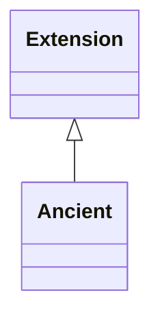

# Class: Extension 


_A collection of recommended metadata terms (slots) developed by community experts, describing the specific context under which a sample was collected._


URI: [MIXS:Extension](https://w3id.org/mixs/Extension)





## Inheritance
* **Extension**
    * [Ancient](Ancient.md)


## Slots

| Name | Cardinality and Range | Description | Inheritance |
| ---  | --- | --- | --- |


## Aliases


* EnvironmentalPackage


## Identifier and Mapping Information


### Schema Source


* from schema: https://w3id.org/mixs


## Mappings

| Mapping Type | Mapped Value |
| ---  | ---  |
| self | MIXS:Extension |
| native | MIXS:Extension |


## LinkML Source

<!-- TODO: investigate https://stackoverflow.com/questions/37606292/how-to-create-tabbed-code-blocks-in-mkdocs-or-sphinx -->

### Direct

<details>
```yaml
name: Extension
description: A collection of recommended metadata terms (slots) developed by community
  experts, describing the specific context under which a sample was collected.
from_schema: https://w3id.org/mixs
aliases:
- EnvironmentalPackage

```
</details>

### Induced

<details>
```yaml
name: Extension
description: A collection of recommended metadata terms (slots) developed by community
  experts, describing the specific context under which a sample was collected.
from_schema: https://w3id.org/mixs
aliases:
- EnvironmentalPackage

```
</details>