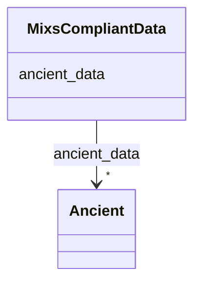

# Class: MIxS compliant data (MixsCompliantData) 


_A collection of data that complies with some combination of a MIxS checklist and environmental extension_


URI: [MIXS:MixsCompliantData](https://w3id.org/mixs/MixsCompliantData)





<!-- no inheritance hierarchy -->


## Slots

| Name | Cardinality and Range | Description | Inheritance |
| ---  | --- | --- | --- |
| [ancient_data](ancient_data.md) | * <br/> [Ancient](Ancient.md) | Data that comply with Extension Ancient | direct |


## Usages

| used by | used in | type | used |
| ---  | --- | --- | --- |
| [MixsCompliantData](MixsCompliantData.md) | [ancient_data](ancient_data.md) | domain | [MixsCompliantData](MixsCompliantData.md) |


## Identifier and Mapping Information


### Schema Source


* from schema: https://w3id.org/mixs


## Mappings

| Mapping Type | Mapped Value |
| ---  | ---  |
| self | MIXS:MixsCompliantData |
| native | MIXS:MixsCompliantData |


## LinkML Source

<!-- TODO: investigate https://stackoverflow.com/questions/37606292/how-to-create-tabbed-code-blocks-in-mkdocs-or-sphinx -->

### Direct

<details>
```yaml
name: MixsCompliantData
description: A collection of data that complies with some combination of a MIxS checklist
  and environmental extension
title: MIxS compliant data
from_schema: https://w3id.org/mixs
slots:
- ancient_data
tree_root: true

```
</details>

### Induced

<details>
```yaml
name: MixsCompliantData
description: A collection of data that complies with some combination of a MIxS checklist
  and environmental extension
title: MIxS compliant data
from_schema: https://w3id.org/mixs
attributes:
  ancient_data:
    name: ancient_data
    description: Data that comply with Extension Ancient
    title: Ancient data
    from_schema: https://w3id.org/mixs
    rank: 1000
    domain: MixsCompliantData
    slot_uri: MIXS:ancient_data
    alias: ancient_data
    owner: MixsCompliantData
    domain_of:
    - MixsCompliantData
    range: Ancient
    multivalued: true
    inlined: true
    inlined_as_list: true
tree_root: true

```
</details>